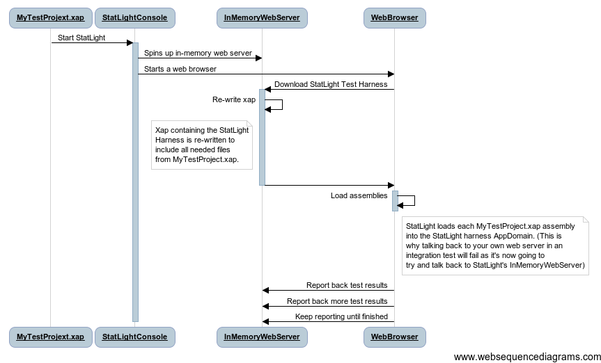

.. _getting_started:

****************************
StatLight Documentation Home
****************************

How does it work?
=============================

StatLight is a console application that creates an in memory web server. It starts up a web browser that will request from the web server a page containing your test xap. By executing all the tests in the browser and communicating test results back to the web server. The console now has the ability to publish those results in manners not allowed in the Silverlight sandbox.

Install
=======
* `StatLight on NuGet <http://nuget.org/List/Packages/StatLight>`_
* `Download <http://statlight.codeplex.com/releases/>`_ unzip into your project's tools folder and leverage as needed.

!! Local Development
* [Continuous Mode] *-c* or *--Continuous* (continuously monitor xap changes and automatically re-runs tests)
* [Test Filtering Options]

!! Extending
In the 1.4 release of StatLight I added a very basic extensibility model. Read more on the [Extensibility Documentation].
